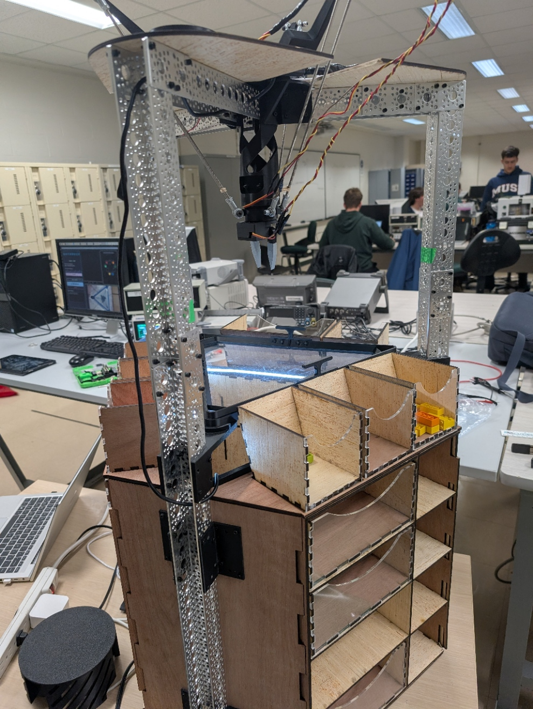
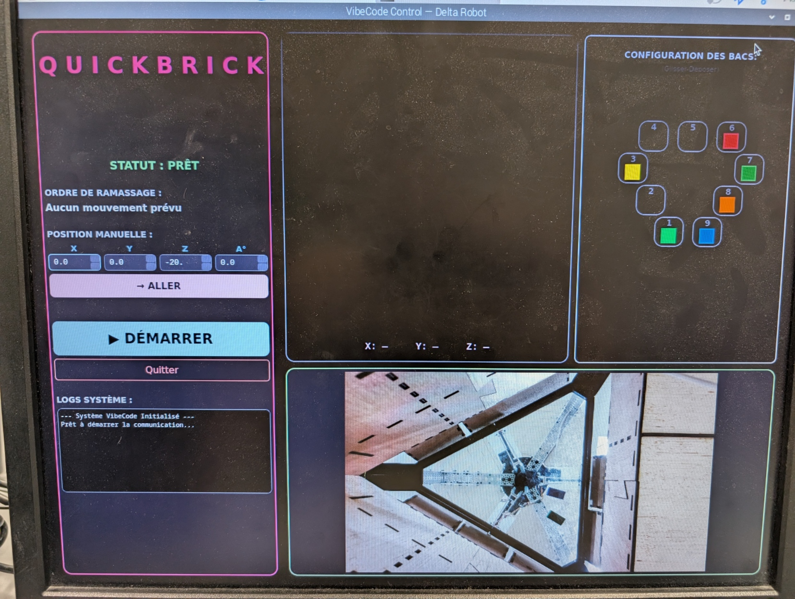
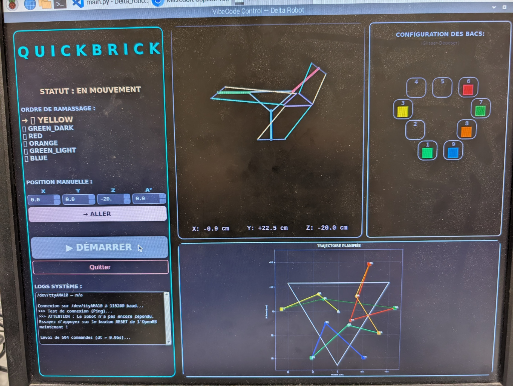

# QuickBrick Delta Robot 

[](https://opensource.org/licenses/MIT)
[](https://www.python.org/downloads/)

> Projet de session S4 — Baccalauréat en Génie Robotique, Université de Sherbrooke.  
> Un système complet de tri automatisé par vision numérique et planification de trajectoire optimale.

Réalisé par  Domenic Coppola, Antoine Côté, Thierry Allen, Antoine Bolduc et Raphaël Gendron.

Utilisation de l'IA générative à des fins de déverminage et d'assistance à la conception.

---

##  Aperçu



| Interface Vision | Planification de Trajectoire |
|:---:|:---:|
|  |  |

---

##  Mise en route rapide

### 1. Installation du logiciel
Clonez le dépôt et installez les dépendances :
```bash
git clone https://github.com/votre-repo/Delta_robot.git
cd Delta_robot
pip install -r requirements.txt
```
Consultez le [Guide d'installation détaillé](docs/software_setup.md) pour la configuration du Raspberry Pi et de la caméra.

### 2. Matériel
Ce projet utilise des moteurs **Dynamixel XC430** et un contrôleur **OpenRB-150**.
Voir la [Documentation Matérielle](docs/hardware.md) pour le schéma de câblage et la liste des composants (BOM).

---

##  Architecture du projet

Le robot intègre plusieurs sous-systèmes travaillant en boucle fermée :

1.  **Vision Numérique** : Détection des blocs et conversion pixel → cm via homographie.
2.  **Planificateur** : Optimisation de l'ordre de tri par algorithme **Branch & Bound** (Problème du voyageur de commerce asymétrique).
3.  **Cinématique** : Modèle géométrique inverse pour le pilotage des 3 bras parallèles.
4.  **UI de Contrôle** : Visualisation 3D en temps réel et interface de configuration des bacs par "Drag & Drop".

###  Structure des dossiers
```
Delta_robot/
├── Arduino/            # Firmware C++ pour OpenRB-150
├── CAD/                # Fichiers CAD (STL et DXF) d'impression 3D et découpe laser
├── CinématiqueRobot/   # Modèles DGM/IGM & Interpolations
├── Communication/      # Protocole série Raspberry Pi ↔ Arduino
├── docs/               # Documentation détaillée (Hardware, Math, Setup)
├── Images/             # Captures et photos du système
├── Trajectoire/        # Algorithmes d'optimisation (BnB, TSP)
├── UI/                 # Interface PyQt6 (VibeCode UI)
└── VisionNumerique/    # Traitement d'image OpenCV & HSV
```

---

##  Documentation détaillée

*   [**Guide Matériel**](docs/hardware.md) : Liste des pièces, électronique et montage.
*   [**Fichiers CAD**](CAD/readme-cad.md) : Fichiers CAD des pièces destinées à l'impression 3D et la découpe laser.
*   [**Installation Logicielle**](docs/software_setup.md) : Configuration de l'environnement Python et flashage Arduino.
*   [**Mathématiques & Cinématique**](docs/kinematics.md) : Détails sur l'IGM et la planification de trajectoire.
*   [**Contribuer**](CONTRIBUTING.md) : Comment aider à améliorer le projet.

---


##  Licence

Ce projet est distribué sous la licence **MIT**. Voir le fichier [LICENSE.txt](LICENSE.txt) pour plus de détails.

---

*Université de Sherbrooke — GRO S4 — 2025-2026*
